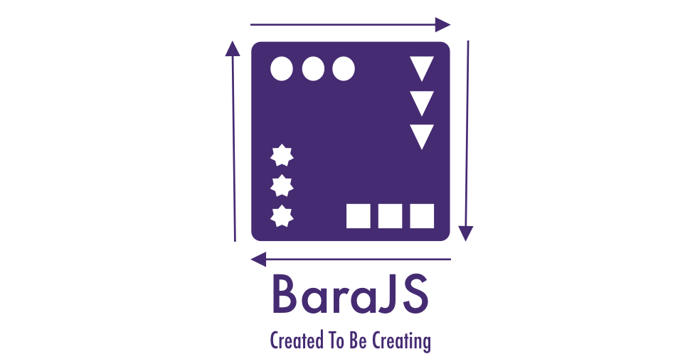

# Bara Specifications

<p align="center">
  
</p>

[](https://github.com/RichardLitt/standard-readme)

> Created to create

Bara (a Hebrew word which mean: `created`) is the new framework to build your applications (front-end), microservices (back-end) based on Reactive Functional Programming techniques.

Bara help you create almost anything you can imaging with the stream of events, conditions, actions. All you have to do is build your module based on Bara's specs and plug it in to the Bara framework.

**Specs are not finished yet. We use the following tag system to identify their state:**

-  - this spec is a work-in-progress, it is likely not even complete.
-  - this spec is a rough draft and will likely change substantially.
-  - this spec is believed to be close to final. Minor changes only.
-  - this spec is likely to improve, but not change fundamentally.
-  - this spec will not change.

## Table of Contents

- [Platform](#platform)
- [Architecture](/architecture)
- [Background](#background)
- [Install](#install)
- [Usage](#usage)
- [API](#api)
- [Maintainers](#maintainers)
- [Contribute](#contribute)
- [License](#license)

## Platform

### Working
- [x] Bara Core Library (TypeScript)

### Proposal
- [ ] Bara CLI (TypeScript, Go, Deb Package, Brew Package)
- [ ] Bara Editor (Electron, Web, Mobile)
- [ ] Bara Dev Tools (Electron, Chrome Extension)
- [ ] Bara DevOps (Dokku, Client CLI)
- [ ] Static Site Hosting (Decentrailize File System with IPFS, Bara CLI)
- [ ] Bara Compute (Decentralize Computing Gateway)
- [ ] BaraDB (Decentralize Database, GraphQL)

## Background

## Install

```
npm install -g bara
```

## Usage

```
bara init
```

## API

## Maintainers

[@nampdn](https://github.com/nampdn)

## Contribute

PRs accepted.

Small note: If editing the README, please conform to the [standard-readme](https://github.com/RichardLitt/standard-readme) specification.

## License

MIT © 2018 Nam Pham
