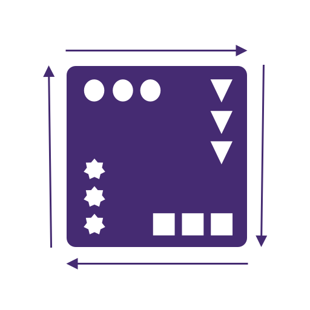

#  Bara Architecture Overview

<p align="center">
  
</p>

This spec document defines the way Bara work with stream of events, conditions, and actions.

## Table of Contents

- [Main](#main)
- [Stream](#stream)
- [Trigger](#trigger)
- [Event](#event)
- [Condition](#condition)
- [Actions](#action)

## Main

- A main is a Bara function which will do the registration of streams and trigger.
- A main function can be a Bara module to combine with other Bara module.

- This is the example main.js file implementation:

```javascript
import bara from "bara";
import StreamFile from "bara-stream-file";
import TriggerFileChange from "bara-trigger-file-change";
import TriggerCountFile from "bara-trigger-count-file";

const streams = [StreamFile("~/Data")];

const triggers = [TriggerFileChange, TriggerCountFile]);

const AwesomeFileService = bara("awesome-file-service", streams, triggers);

export default AwesomeFileService;
```

## Stream

- A Stream is the list of events emitted over the time of Bara process.
- A Stream can be registered to a Bara main module to listen on a specific event.
- A Stream does not take care of which trigger will consume the emitting event.
- A Stream only take care of one type of event with different payload.

Code usage example:

```javascript
import {registerStream, createEventType, createEmitEvent} from "bara";
import chokidar from "chokidar";

const events = {
  FILE_CREATED: createEventType("FILE_CREATED"),
  FILE_CHANGED: createEventType("FILE_CHANGED"),
};

const FileStream = createStream({
  id: "org.barajs.stream.file",
  name: "Bara Stream File",
  events: events,
  methods: {
    // Define the initializer of stream
    init: (emit, payload) => {
      // Define the location to watch files.
      const pathToWatch = payload;

      // Register file watcher.
      const watcher = chokidar(pathToWatch);

      // Emit event to the stream when a file is added.
      watcher
        .on('add', path => emit(events.FILE_CREATED, path));
        .on('change', path => emit(events.FILE_CHANGED, path));
    },
    onEvent: (eventType, payload) => {
      return createEmitEvent(eventType, payload);
    }
  }
});

export default FileStream;
```

## Trigger

- A trigger is built from 3 facts: Events, Conditions, and Actions.
- A trigger required at least one Event to be triggered, and a trigger can have only one Event registered at a time.
- A trigger can have Conditions or not, if no condition is specified in the trigger, any of the registered Event(s) can trigger its Actions.
- A trigger can be called/executed from another trigger directly when needed (omitting the Event also possible, but it should required direct Event input).

## Event

- In the Bara's trigger, an event is emitted from the Stream.
- An Event should have a declarative name to reference with the Event Source (who emitted the event).
- An Event should filter the Stream in general case, such as: `A file is changed` or `A button is clicked`.
- An Event can have specific targeted event listener like: `A file with extension .mp3 is changed` or `Login button is clicked`.

## Condition

- A condition is the event filtered at the trigger scope.
- A condition can receive event reference from the trigger's event.
- A collection of conditions can be combined to have a more complex condition.


## Action

- An action is the sequence of statements defined by the user.
- An action can receive event reference from the trigger's event.
- An action can have reference to the global application store to access others in the memory.
